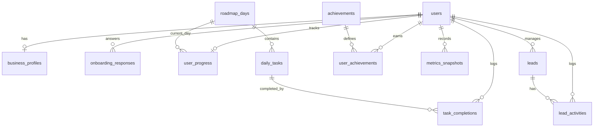

# Founder OS - PostgreSQL Database Schema

This document outlines the complete relational database schema for Founder OS, designed for Supabase. It uses PostgreSQL with UUID primary keys and strict Row Level Security (RLS) policies for multi-tenancy.

## ER Diagram



## Tables & Policies

### 1. `users`
Extends the native `auth.users` provided by Supabase to store additional application-level profile data.

```sql
CREATE TABLE users (
    id UUID PRIMARY KEY REFERENCES auth.users(id) ON DELETE CASCADE,
    email TEXT UNIQUE NOT NULL,
    full_name TEXT,
    created_at TIMESTAMPTZ DEFAULT now() NOT NULL,
    updated_at TIMESTAMPTZ DEFAULT now() NOT NULL
);

ALTER TABLE users ENABLE ROW LEVEL SECURITY;

CREATE POLICY "Users can view own profile" 
    ON users FOR SELECT USING (auth.uid() = id);

CREATE POLICY "Users can update own profile" 
    ON users FOR UPDATE USING (auth.uid() = id);
```

### 2. `business_profiles`
Stores the user's specific business parameters. One-to-one relationship with `users`.

```sql
CREATE TABLE business_profiles (
    id UUID PRIMARY KEY DEFAULT gen_random_uuid(),
    user_id UUID REFERENCES users(id) ON DELETE CASCADE NOT NULL UNIQUE,
    niche TEXT NOT NULL,
    service TEXT NOT NULL,
    offer_statement TEXT,
    price NUMERIC,
    monthly_goal NUMERIC,
    created_at TIMESTAMPTZ DEFAULT now() NOT NULL,
    updated_at TIMESTAMPTZ DEFAULT now() NOT NULL
);

ALTER TABLE business_profiles ENABLE ROW LEVEL SECURITY;

CREATE POLICY "Users can manage own business profile" 
    ON business_profiles FOR ALL USING (auth.uid() = user_id);
```

### 3. `onboarding_responses`
Stores raw answers from the onboarding/intake form for deeper coaching personalization.

```sql
CREATE TABLE onboarding_responses (
    id UUID PRIMARY KEY DEFAULT gen_random_uuid(),
    user_id UUID REFERENCES users(id) ON DELETE CASCADE NOT NULL,
    question_id TEXT NOT NULL,
    response_text TEXT NOT NULL,
    created_at TIMESTAMPTZ DEFAULT now() NOT NULL,
    updated_at TIMESTAMPTZ DEFAULT now() NOT NULL
);

ALTER TABLE onboarding_responses ENABLE ROW LEVEL SECURITY;

CREATE POLICY "Users can manage own onboarding responses" 
    ON onboarding_responses FOR ALL USING (auth.uid() = user_id);
```

### 4. `roadmap_days`
A global "seed data" table that defines the 30 canonical days of the program. Everyone reads the same data.

```sql
CREATE TABLE roadmap_days (
    id UUID PRIMARY KEY DEFAULT gen_random_uuid(),
    day_number INTEGER UNIQUE NOT NULL,
    title TEXT NOT NULL,
    description TEXT,
    created_at TIMESTAMPTZ DEFAULT now() NOT NULL,
    updated_at TIMESTAMPTZ DEFAULT now() NOT NULL
);

ALTER TABLE roadmap_days ENABLE ROW LEVEL SECURITY;

-- Everyone can read seed data. Only admins (bypassing RLS) can create/update.
CREATE POLICY "Roadmap days are viewable by all authenticated users" 
    ON roadmap_days FOR SELECT USING (auth.uid() IS NOT NULL);
```

### 5. `user_progress`
Tracks the current state of a user's journey through the 30-day roadmap.

```sql
CREATE TABLE user_progress (
    id UUID PRIMARY KEY DEFAULT gen_random_uuid(),
    user_id UUID REFERENCES users(id) ON DELETE CASCADE NOT NULL UNIQUE,
    current_roadmap_day_id UUID REFERENCES roadmap_days(id),
    started_at TIMESTAMPTZ DEFAULT now() NOT NULL,
    completed_at TIMESTAMPTZ,
    created_at TIMESTAMPTZ DEFAULT now() NOT NULL,
    updated_at TIMESTAMPTZ DEFAULT now() NOT NULL
);

ALTER TABLE user_progress ENABLE ROW LEVEL SECURITY;

CREATE POLICY "Users can manage own progress" 
    ON user_progress FOR ALL USING (auth.uid() = user_id);
```

### 6. `daily_tasks`
Stores both canonical tasks (where `user_id` is NULL) and AI-personalized customized tasks (where `user_id` is set).

```sql
CREATE TABLE daily_tasks (
    id UUID PRIMARY KEY DEFAULT gen_random_uuid(),
    roadmap_day_id UUID REFERENCES roadmap_days(id) ON DELETE CASCADE NOT NULL,
    user_id UUID REFERENCES users(id) ON DELETE CASCADE, -- NULL means canonical seed data
    title TEXT NOT NULL,
    description TEXT,
    is_mandatory BOOLEAN DEFAULT true,
    created_at TIMESTAMPTZ DEFAULT now() NOT NULL,
    updated_at TIMESTAMPTZ DEFAULT now() NOT NULL
);

ALTER TABLE daily_tasks ENABLE ROW LEVEL SECURITY;

-- Users can view canonical tasks AND their own personalized tasks
CREATE POLICY "Users can view relevant tasks" 
    ON daily_tasks FOR SELECT 
    USING (user_id IS NULL OR auth.uid() = user_id);

-- Users can only modify their personalized tasks if the app generates them
CREATE POLICY "Users can manage own personalized tasks" 
    ON daily_tasks FOR ALL 
    USING (auth.uid() = user_id);
```

### 7. `task_completions`
An audit log tracking the exact time a user completed a specific daily task.

```sql
CREATE TABLE task_completions (
    id UUID PRIMARY KEY DEFAULT gen_random_uuid(),
    user_id UUID REFERENCES users(id) ON DELETE CASCADE NOT NULL,
    daily_task_id UUID REFERENCES daily_tasks(id) ON DELETE CASCADE NOT NULL,
    completed_at TIMESTAMPTZ DEFAULT now() NOT NULL,
    created_at TIMESTAMPTZ DEFAULT now() NOT NULL,
    updated_at TIMESTAMPTZ DEFAULT now() NOT NULL,
    UNIQUE(user_id, daily_task_id) -- Prevent duplicate completions
);

ALTER TABLE task_completions ENABLE ROW LEVEL SECURITY;

CREATE POLICY "Users can manage own task completions" 
    ON task_completions FOR ALL USING (auth.uid() = user_id);
```

### 8. `leads`
Basic CRM functionality to track prospective clients.

```sql
CREATE TABLE leads (
    id UUID PRIMARY KEY DEFAULT gen_random_uuid(),
    user_id UUID REFERENCES users(id) ON DELETE CASCADE NOT NULL,
    name TEXT NOT NULL,
    company TEXT,
    contact_info TEXT,
    niche TEXT,
    status TEXT DEFAULT 'Lead' NOT NULL, -- e.g., 'Lead', 'Contacted', 'Booked', 'Closed'
    created_at TIMESTAMPTZ DEFAULT now() NOT NULL,
    updated_at TIMESTAMPTZ DEFAULT now() NOT NULL
);

ALTER TABLE leads ENABLE ROW LEVEL SECURITY;

CREATE POLICY "Users can manage own leads" 
    ON leads FOR ALL USING (auth.uid() = user_id);
```

### 9. `lead_activities`
Audits the distinct actions taken over time with a specific lead (useful for tracking the journey from DM -> Closed).

```sql
CREATE TABLE lead_activities (
    id UUID PRIMARY KEY DEFAULT gen_random_uuid(),
    user_id UUID REFERENCES users(id) ON DELETE CASCADE NOT NULL,
    lead_id UUID REFERENCES leads(id) ON DELETE CASCADE NOT NULL,
    activity_type TEXT NOT NULL, -- 'contacted', 'replied', 'booked', 'closed', etc.
    notes TEXT,
    created_at TIMESTAMPTZ DEFAULT now() NOT NULL,
    updated_at TIMESTAMPTZ DEFAULT now() NOT NULL
);

ALTER TABLE lead_activities ENABLE ROW LEVEL SECURITY;

CREATE POLICY "Users can manage own lead activities" 
    ON lead_activities FOR ALL USING (auth.uid() = user_id);
```

### 10. `achievements`
Global seed table defining the badges and milestones users can earn.

```sql
CREATE TABLE achievements (
    id UUID PRIMARY KEY DEFAULT gen_random_uuid(),
    name TEXT NOT NULL,
    description TEXT,
    badge_image_url TEXT,
    created_at TIMESTAMPTZ DEFAULT now() NOT NULL,
    updated_at TIMESTAMPTZ DEFAULT now() NOT NULL
);

ALTER TABLE achievements ENABLE ROW LEVEL SECURITY;

CREATE POLICY "Achievements are viewable by all authenticated users" 
    ON achievements FOR SELECT USING (auth.uid() IS NOT NULL);
```

### 11. `user_achievements`
Tracks which badges the user has officially unlocked.

```sql
CREATE TABLE user_achievements (
    id UUID PRIMARY KEY DEFAULT gen_random_uuid(),
    user_id UUID REFERENCES users(id) ON DELETE CASCADE NOT NULL,
    achievement_id UUID REFERENCES achievements(id) ON DELETE CASCADE NOT NULL,
    earned_at TIMESTAMPTZ DEFAULT now() NOT NULL,
    created_at TIMESTAMPTZ DEFAULT now() NOT NULL,
    updated_at TIMESTAMPTZ DEFAULT now() NOT NULL,
    UNIQUE(user_id, achievement_id) -- Can only earn once
);

ALTER TABLE user_achievements ENABLE ROW LEVEL SECURITY;

CREATE POLICY "Users can manage own earned achievements" 
    ON user_achievements FOR ALL USING (auth.uid() = user_id);
```

### 12. `metrics_snapshots`
Provides weekly/periodic aggregations so the user can visualize their input vs. output dynamically over time.

```sql
CREATE TABLE metrics_snapshots (
    id UUID PRIMARY KEY DEFAULT gen_random_uuid(),
    user_id UUID REFERENCES users(id) ON DELETE CASCADE NOT NULL,
    snapshot_date DATE NOT NULL,
    dms_sent INTEGER DEFAULT 0,
    calls_booked INTEGER DEFAULT 0,
    clients_closed INTEGER DEFAULT 0,
    revenue NUMERIC DEFAULT 0,
    created_at TIMESTAMPTZ DEFAULT now() NOT NULL,
    updated_at TIMESTAMPTZ DEFAULT now() NOT NULL,
    UNIQUE(user_id, snapshot_date) -- Only one snapshot per timeframe
);

ALTER TABLE metrics_snapshots ENABLE ROW LEVEL SECURITY;

CREATE POLICY "Users can manage own metrics snapshots" 
    ON metrics_snapshots FOR ALL USING (auth.uid() = user_id);
```

### 13. `revenue_logs`
An audit trail for manually inputted cash collected logic.

```sql
CREATE TABLE revenue_logs (
    id UUID PRIMARY KEY DEFAULT gen_random_uuid(),
    user_id UUID REFERENCES users(id) ON DELETE CASCADE NOT NULL,
    amount NUMERIC NOT NULL,
    client_name TEXT,
    logged_at TIMESTAMPTZ DEFAULT now() NOT NULL,
    created_at TIMESTAMPTZ DEFAULT now() NOT NULL
);

ALTER TABLE revenue_logs ENABLE ROW LEVEL SECURITY;

CREATE POLICY "Users can manage own revenue logs" 
    ON revenue_logs FOR ALL USING (auth.uid() = user_id);
```
