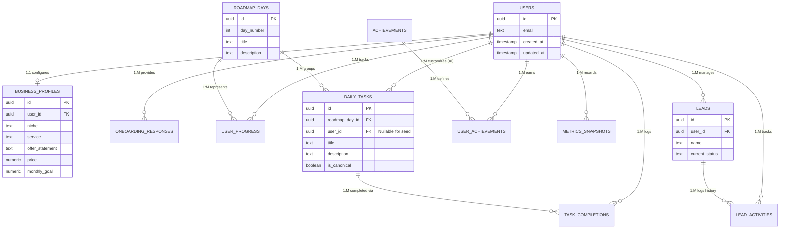

# Founder OS - Supabase PostgreSQL Schema Design

This document covers the complete PostgreSQL database schema for Founder OS, tailored for Supabase. It includes table definitions with constraints, Row Level Security (RLS) policies, and an Entity-Relationship (ER) diagram.

> [!NOTE]
> All tables ensure multi-tenancy through `user_id` enforcement (except pure seed data tables), use `gen_random_uuid()` for primary keys, utilize `TIMESTAMP WITH TIME ZONE`, and enforce Row Level Security.
> 
> A common `moddatetime` or custom trigger should be applied to automatically update `updated_at` timestamps on row updates. For brevity, the trigger attachment is assumed to exist for each table utilizing `updated_at`.

## 1. Entity-Relationship Diagram



---

## 2. Table Definitions & RLS Policies

### 2.1 Users (`users`)
Extends Supabase's `auth.users` to store public profile data. The PK matches the Auth UI securely.
```sql
CREATE TABLE public.users (
    id UUID PRIMARY KEY REFERENCES auth.users(id) ON DELETE CASCADE,
    full_name TEXT NOT NULL,
    email TEXT UNIQUE NOT NULL,
    created_at TIMESTAMPTZ NOT NULL DEFAULT NOW(),
    updated_at TIMESTAMPTZ NOT NULL DEFAULT NOW()
);

-- RLS: Users can only read and update their own data.
ALTER TABLE public.users ENABLE ROW LEVEL SECURITY;

CREATE POLICY "Users can view own record" ON public.users FOR SELECT USING (auth.uid() = id);
CREATE POLICY "Users can update own record" ON public.users FOR UPDATE USING (auth.uid() = id);
```

### 2.2 Business Profiles (`business_profiles`)
Stores the core configuring state of a founder's business. Constrained to 1-to-1 with a unique user_id. Normalized strings.
```sql
CREATE TABLE public.business_profiles (
    id UUID PRIMARY KEY DEFAULT gen_random_uuid(),
    user_id UUID NOT NULL UNIQUE REFERENCES public.users(id) ON DELETE CASCADE,
    niche TEXT NOT NULL,
    service TEXT NOT NULL,
    offer_statement TEXT,
    price NUMERIC(10, 2) NOT NULL DEFAULT 0.00,
    monthly_goal NUMERIC(10, 2) NOT NULL DEFAULT 0.00,
    created_at TIMESTAMPTZ NOT NULL DEFAULT NOW(),
    updated_at TIMESTAMPTZ NOT NULL DEFAULT NOW()
);

-- RLS
ALTER TABLE public.business_profiles ENABLE ROW LEVEL SECURITY;
CREATE POLICY "Select own business profile" ON public.business_profiles FOR SELECT USING (auth.uid() = user_id);
CREATE POLICY "Insert own business profile" ON public.business_profiles FOR INSERT WITH CHECK (auth.uid() = user_id);
CREATE POLICY "Update own business profile" ON public.business_profiles FOR UPDATE USING (auth.uid() = user_id);
CREATE POLICY "Delete own business profile" ON public.business_profiles FOR DELETE USING (auth.uid() = user_id);
```

### 2.3 Onboarding Responses (`onboarding_responses`)
Captures raw answers from the initial intake form, kept distinct to feed the AI context separate from profile settings.
```sql
CREATE TABLE public.onboarding_responses (
    id UUID PRIMARY KEY DEFAULT gen_random_uuid(),
    user_id UUID NOT NULL REFERENCES public.users(id) ON DELETE CASCADE,
    question_key TEXT NOT NULL,
    raw_answer TEXT NOT NULL,
    created_at TIMESTAMPTZ NOT NULL DEFAULT NOW(),
    updated_at TIMESTAMPTZ NOT NULL DEFAULT NOW()
);

-- RLS
ALTER TABLE public.onboarding_responses ENABLE ROW LEVEL SECURITY;
CREATE POLICY "Manage own responses" ON public.onboarding_responses FOR ALL USING (auth.uid() = user_id);
```

### 2.4 Roadmap Days (`roadmap_days`)
Seed data defining the canonical 30 days. No user scoping is required since it's immutable system data.
```sql
CREATE TABLE public.roadmap_days (
    id UUID PRIMARY KEY DEFAULT gen_random_uuid(),
    day_number INTEGER NOT NULL UNIQUE CHECK (day_number BETWEEN 1 AND 30),
    title TEXT NOT NULL,
    theme TEXT NOT NULL,
    description TEXT,
    created_at TIMESTAMPTZ NOT NULL DEFAULT NOW(),
    updated_at TIMESTAMPTZ NOT NULL DEFAULT NOW()
);

-- RLS: Read-only for all authenticated users. No manual mutation.
ALTER TABLE public.roadmap_days ENABLE ROW LEVEL SECURITY;
CREATE POLICY "Read only roadmap days" ON public.roadmap_days FOR SELECT USING (auth.role() = 'authenticated');
```

### 2.5 Daily Tasks (`daily_tasks`)
Stores tasks. Mixed usage: canonical tasks (seed data, user_id=NULL) vs. AI personalized tasks (user_id required).
```sql
CREATE TABLE public.daily_tasks (
    id UUID PRIMARY KEY DEFAULT gen_random_uuid(),
    roadmap_day_id UUID NOT NULL REFERENCES public.roadmap_days(id) ON DELETE CASCADE,
    user_id UUID REFERENCES public.users(id) ON DELETE CASCADE, -- NULL for canonical
    title TEXT NOT NULL,
    description TEXT,
    is_canonical BOOLEAN NOT NULL DEFAULT FALSE,
    ai_prompt_context TEXT, -- Information the AI used to personalize this task
    created_at TIMESTAMPTZ NOT NULL DEFAULT NOW(),
    updated_at TIMESTAMPTZ NOT NULL DEFAULT NOW(),
    CONSTRAINT canonical_or_user_defined CHECK (
        (is_canonical = TRUE AND user_id IS NULL) OR 
        (is_canonical = FALSE AND user_id IS NOT NULL)
    )
);

-- RLS
ALTER TABLE public.daily_tasks ENABLE ROW LEVEL SECURITY;
CREATE POLICY "Select canonical and own personalized tasks" 
    ON public.daily_tasks FOR SELECT USING (is_canonical = TRUE OR auth.uid() = user_id);
-- Users can only insert/update/delete their own custom personalized tasks
CREATE POLICY "Manage own tasks" 
    ON public.daily_tasks FOR ALL USING (auth.uid() = user_id) WITH CHECK (auth.uid() = user_id);
```

### 2.6 User Progress (`user_progress`)
Tracks high-level status of the 30-day journey. One row per day per user limits duplications.
```sql
CREATE TABLE public.user_progress (
    id UUID PRIMARY KEY DEFAULT gen_random_uuid(),
    user_id UUID NOT NULL REFERENCES public.users(id) ON DELETE CASCADE,
    roadmap_day_id UUID NOT NULL REFERENCES public.roadmap_days(id) ON DELETE CASCADE,
    status TEXT NOT NULL CHECK (status IN ('locked', 'available', 'in_progress', 'completed')),
    started_at TIMESTAMPTZ,
    completed_at TIMESTAMPTZ,
    created_at TIMESTAMPTZ NOT NULL DEFAULT NOW(),
    updated_at TIMESTAMPTZ NOT NULL DEFAULT NOW(),
    UNIQUE(user_id, roadmap_day_id) -- Only 1 entry per day per user
);

-- RLS
ALTER TABLE public.user_progress ENABLE ROW LEVEL SECURITY;
CREATE POLICY "Manage own progress" ON public.user_progress FOR ALL USING (auth.uid() = user_id);
```

### 2.7 Task Completions (`task_completions`)
Explicit log holding accountability for tasks. Separate from daily_tasks because canonical tasks are shared entity objects.
```sql
CREATE TABLE public.task_completions (
    id UUID PRIMARY KEY DEFAULT gen_random_uuid(),
    user_id UUID NOT NULL REFERENCES public.users(id) ON DELETE CASCADE,
    task_id UUID NOT NULL REFERENCES public.daily_tasks(id) ON DELETE CASCADE,
    completed_at TIMESTAMPTZ NOT NULL DEFAULT NOW(),
    created_at TIMESTAMPTZ NOT NULL DEFAULT NOW(),
    updated_at TIMESTAMPTZ NOT NULL DEFAULT NOW(),
    UNIQUE(user_id, task_id) -- users can't complete the same task twice
);

-- RLS
ALTER TABLE public.task_completions ENABLE ROW LEVEL SECURITY;
CREATE POLICY "Manage own task completions" ON public.task_completions FOR ALL USING (auth.uid() = user_id);
```

### 2.8 Leads (`leads`)
Core CRM table defining prospects. Kept clean; all history shifts to activities.
```sql
CREATE TABLE public.leads (
    id UUID PRIMARY KEY DEFAULT gen_random_uuid(),
    user_id UUID NOT NULL REFERENCES public.users(id) ON DELETE CASCADE,
    name TEXT NOT NULL,
    company TEXT,
    contact_info TEXT, -- could be email, LinkedIn URL, etc.
    niche TEXT,
    current_status TEXT NOT NULL DEFAULT 'lead' CHECK (current_status IN ('lead', 'contacted', 'replied', 'booked', 'closed')),
    created_at TIMESTAMPTZ NOT NULL DEFAULT NOW(),
    updated_at TIMESTAMPTZ NOT NULL DEFAULT NOW()
);

-- RLS
ALTER TABLE public.leads ENABLE ROW LEVEL SECURITY;
CREATE POLICY "Manage own leads" ON public.leads FOR ALL USING (auth.uid() = user_id);
```

### 2.9 Lead Activities (`lead_activities`)
Audit trail/timeline for every CRM touch-point. Powers the accountability dashboard.
```sql
CREATE TABLE public.lead_activities (
    id UUID PRIMARY KEY DEFAULT gen_random_uuid(),
    user_id UUID NOT NULL REFERENCES public.users(id) ON DELETE CASCADE,
    lead_id UUID NOT NULL REFERENCES public.leads(id) ON DELETE CASCADE,
    activity_type TEXT NOT NULL CHECK (activity_type IN ('contacted', 'replied', 'booked', 'closed', 'note_added', 'rejected')),
    notes TEXT, -- optional details for AI parsing
    created_at TIMESTAMPTZ NOT NULL DEFAULT NOW(),
    updated_at TIMESTAMPTZ NOT NULL DEFAULT NOW()
);

-- RLS
ALTER TABLE public.lead_activities ENABLE ROW LEVEL SECURITY;
CREATE POLICY "Manage own lead activities" ON public.lead_activities FOR ALL USING (auth.uid() = user_id);
```

### 2.10 Achievements (`achievements`)
Seed data for badging configurations.
```sql
CREATE TABLE public.achievements (
    id UUID PRIMARY KEY DEFAULT gen_random_uuid(),
    identifier TEXT NOT NULL UNIQUE, -- e.g. 'first_outreach', '3_day_streak'
    name TEXT NOT NULL,
    description TEXT NOT NULL,
    icon_url TEXT,
    created_at TIMESTAMPTZ NOT NULL DEFAULT NOW(),
    updated_at TIMESTAMPTZ NOT NULL DEFAULT NOW()
);

-- RLS: Read-only
ALTER TABLE public.achievements ENABLE ROW LEVEL SECURITY;
CREATE POLICY "Read only achievements" ON public.achievements FOR SELECT USING (auth.role() = 'authenticated');
```

### 2.11 User Achievements (`user_achievements`)
Earned badges per user.
```sql
CREATE TABLE public.user_achievements (
    id UUID PRIMARY KEY DEFAULT gen_random_uuid(),
    user_id UUID NOT NULL REFERENCES public.users(id) ON DELETE CASCADE,
    achievement_id UUID NOT NULL REFERENCES public.achievements(id) ON DELETE CASCADE,
    earned_at TIMESTAMPTZ NOT NULL DEFAULT NOW(),
    created_at TIMESTAMPTZ NOT NULL DEFAULT NOW(),
    updated_at TIMESTAMPTZ NOT NULL DEFAULT NOW(),
    UNIQUE(user_id, achievement_id) 
);

-- RLS
ALTER TABLE public.user_achievements ENABLE ROW LEVEL SECURITY;
CREATE POLICY "Manage own achievements" ON public.user_achievements FOR ALL USING (auth.uid() = user_id);
```

### 2.12 Metrics Snapshots (`metrics_snapshots`)
For reporting and plotting 90-day trajectory. Generated programmatically on a cron/batch end-of-week function.
```sql
CREATE TABLE public.metrics_snapshots (
    id UUID PRIMARY KEY DEFAULT gen_random_uuid(),
    user_id UUID NOT NULL REFERENCES public.users(id) ON DELETE CASCADE,
    week_start_date DATE NOT NULL,
    dms_sent INTEGER NOT NULL DEFAULT 0,
    calls_booked INTEGER NOT NULL DEFAULT 0,
    clients_closed INTEGER NOT NULL DEFAULT 0,
    revenue NUMERIC(10, 2) NOT NULL DEFAULT 0.00,
    created_at TIMESTAMPTZ NOT NULL DEFAULT NOW(),
    updated_at TIMESTAMPTZ NOT NULL DEFAULT NOW(),
    UNIQUE(user_id, week_start_date)
);

-- RLS
ALTER TABLE public.metrics_snapshots ENABLE ROW LEVEL SECURITY;
CREATE POLICY "Manage own metric snapshots" ON public.metrics_snapshots FOR ALL USING (auth.uid() = user_id);
```
